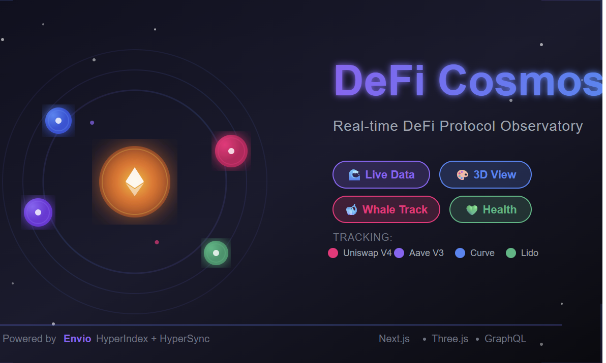

# DeFi Cosmos

> **Real-time DeFi Analytics Through the Lens of Space**

A next-generation Web3 analytics dashboard that visualizes DeFi protocols as an interactive 3D solar system, revealing invisible capital flows and patterns across the DeFi ecosystem.

[](https://envio.dev)
[](https://nextjs.org)
[](https://threejs.org)

---

<br/>

<p align="center">
  
</p>

## 🌟 Overview

**DeFi Cosmos** transforms complex DeFi data into an intuitive 3D solar system where:

- 🌞 **The Sun** = Ethereum network (center of the ecosystem)
- 🪐 **Planets** = DeFi protocols (Uniswap, Aave, Lido, Curve)
- 📏 **Planet Size** = Total Value Locked (TVL)
- 🎨 **Planet Color** = Protocol health (🟢 Green → 🟡 Yellow → 🔴 Red)
- ⚡ **Orbital Speed** = Transaction velocity (TPS)

### What Makes DeFi Cosmos Different?

Unlike traditional dashboards (DefiLlama, Dune Analytics), DeFi Cosmos reveals:

1. **Real-Time Capital Flows** - Watch money move between protocols live
2. **Whale Pattern Detection** - Identify sophisticated traders and their strategies
3. **Protocol Health Monitoring** - Early warning system for protocol risks
4. **Cross-Protocol Activity** - Track wallets using multiple protocols
5. **Interactive 3D Visualization** - Explore DeFi data in a revolutionary way
6. **Live Activity Feed** - Real-time transaction stream across all protocols
7. **User Analytics** - Adoption, retention, and activity heatmaps

---

## 🚀 Key Features

### 1. 3D Protocol Observatory
- Interactive solar system with real-time updates
- Dynamic planet sizing based on TVL
- Health-based color coding
- Clickable planets with detailed stats modals
- Smooth camera controls and animations

### 2. Live Activity Feed
- Real-time transaction stream from all protocols
- Whale detection and badges (>100 ETH)
- Protocol filtering (All, Uniswap, Aave, Lido, Curve)
- Transaction type breakdowns
- Direct Etherscan links

### 3. Protocol Health Monitoring
- Health scores (0-100) with visual indicators
- Multi-factor risk assessment:
  - High utilization rate (>85%)
  - TVL decline detection (>10% in 24h)
  - Whale exit tracking (3+ in 1 hour)
  - Gas spike alerts (2x normal)
  - Liquidation cascade risk
- Real-time warning generation

### 4. User Activity Analytics
- 24-hour activity heatmaps
- Protocol user distribution
- Retention rate tracking
- Active vs total user metrics
- User type segmentation

### 5. Real-Time Data Updates
- 2-second polling for protocol stats
- 3-second polling for transactions
- 5-second polling for health monitoring
- Sub-2-second end-to-end latency
- Automatic cache invalidation with SWR

### 6. Analytics Dashboard
- TPS by Protocol (stacked area charts)
- Volume Distribution (pie charts)
- Transaction Type Analysis (bar charts)
- Protocol Comparison Tools
- Live metrics ticker

---

## 🏗️ Architecture

```
┌─────────────────────────────────────────────────┐
│           Ethereum Mainnet                      │
│        (Smart Contract Events)                  │
└────────────────┬────────────────────────────────┘
                 ↓
┌─────────────────────────────────────────────────┐
│         Envio HyperSync Layer                   │
│   • Ultra-fast blockchain data (2000x RPC)      │
│   • Real-time event streaming                   │
└────────────────┬────────────────────────────────┘
                 ↓
┌─────────────────────────────────────────────────┐
│         Envio HyperIndex                        │
│   • Event handlers (TypeScript)                 │
│   • Cross-protocol correlation                  │
│   • Whale pattern detection                     │
│   • Health score calculations                   │
│   • PostgreSQL storage                          │
└────────────────┬────────────────────────────────┘
                 ↓
┌─────────────────────────────────────────────────┐
│       Hasura GraphQL Engine                     │
│   • Auto-generated GraphQL API                  │
│   • HTTP endpoint for queries                   │
└────────────────┬────────────────────────────────┘
                 ↓ HTTP Polling (SWR)
┌─────────────────────────────────────────────────┐
│         SWR + graphql-request                   │
│   • 2-second polling intervals                  │
│   • Automatic caching                           │
│   • Request deduplication                       │
└────────────────┬────────────────────────────────┘
                 ↓
┌─────────────────────────────────────────────────┐
│       Next.js 14 Frontend                       │
│   • 3D Cosmos (Three.js)                        │
│   • Live Activity Feed                          │
│   • User Analytics                              │
│   • Protocol Health Monitor                     │
│   • Real-time Charts                            │
└─────────────────────────────────────────────────┘
```

---

## 🛠️ Tech Stack

### Backend (Indexer)
- **Envio HyperSync** - Ultra-fast blockchain data ingestion
- **Envio HyperIndex** - Event indexing and processing
- **PostgreSQL** - Database (managed by Envio)
- **Hasura GraphQL** - Auto-generated API layer
- **TypeScript** - Event handler logic

### Frontend
- **Next.js 14** - React framework (App Router)
- **TypeScript 5** - Type safety
- **SWR 2.3** - Data fetching with HTTP polling
- **graphql-request** - GraphQL client
- **Three.js r159** - 3D visualization
- **@react-three/fiber** - React renderer for Three.js
- **@react-three/drei** - Helper components
- **Recharts** - Charts and graphs
- **Tailwind CSS** - Styling
- **shadcn/ui** - UI component library
- **Lucide React** - Icons
- **Framer Motion** - Animations

### Infrastructure
- **Envio Hosted Service** - Backend deployment
- **Vercel** - Frontend deployment
- **pnpm** - Package management

---

## 🚀 Getting Started

### Prerequisites

```bash
# Node.js 18+
node --version

# pnpm (recommended)
npm install -g pnpm

# Envio CLI (for backend)
pnpm add -g envio
```

### Backend Setup (Indexer)

1. **Navigate to indexer directory:**
```bash
cd indexer
```

2. **Install dependencies:**
```bash
pnpm install
```

3. **Start Docker Desktop**

4. **Generate types:**
```bash
envio codegen
```

5. **Start local development server:**
```bash
envio dev
```

This will start:
- HyperSync indexer
- PostgreSQL database
- Hasura GraphQL engine at `http://localhost:8080`

6. **Test in Hasura console:**
```bash
open http://localhost:8080
```

Run test queries to verify data is being indexed.


### Frontend Setup

1. **Navigate to frontend directory:**
```bash
cd frontend
```

2. **Install dependencies:**
```bash
pnpm install
```

3. **Configure environment variables:**
```bash
# Create .env.local
cp env.example .env.local

# Edit .env.local:
NEXT_PUBLIC_GRAPHQL_HTTP=http://localhost:8080/v1/graphql

# For production:
NEXT_PUBLIC_GRAPHQL_HTTP=https://indexer.dev.hyperindex.xyz/[YOUR_KEY]/v1/graphql
```

4. **Start development server:**
```bash
pnpm dev
```

Open `http://localhost:3000` in your browser.

5. **Build for production:**
```bash
pnpm build
pnpm start
```

---

## 🎯 Protocols Tracked

| Protocol | Type | Events Tracked | Key Metrics |
|----------|------|----------------|-------------|
| **Uniswap V4** | DEX | ModifyLiquidity | TVL, Volume, TPS, Liquidity Changes |
| **Aave V3** | Lending | Supply, Withdraw, Borrow, Repay, Liquidation | TVL, Utilization Rate, Health Factor, Borrow/Supply Rates |
| **Lido** | Liquid Staking | Submitted (staking) | Total Staked ETH, Stakers Count, Staking Rate |
| **Curve Finance** | Stable Swaps | AddLiquidity, RemoveLiquidity, TokenExchange | TVL, Trading Volume, Liquidity Changes |

---

## ⚡ Performance & Optimization

### Frontend Performance
- **3D Rendering:** 60 FPS (optimized with instanced meshes)
- **Initial Load:** <3 seconds
- **Data Refresh:** 2-second polling (feels real-time)
- **Bundle Size:** Optimized with code splitting

### Data Fetching Strategy
- **Pattern:** SWR with HTTP polling (no WebSocket)
- **Reason:** Envio's Hasura endpoint is HTTP-only
- **Benefits:**
  - Simpler connection management
  - Automatic caching and deduplication
  - Focus revalidation
  - Error retry with exponential backoff

### Optimizations Applied
1. ✅ React.memo for expensive components
2. ✅ useMemo for heavy calculations
3. ✅ Dynamic imports for 3D components
4. ✅ Image optimization with Next.js Image
5. ✅ Debounced updates for rapid changes
6. ✅ Proper BigInt/BigDecimal conversions

---

## 🤝 Contributing

Welcoming contributions! Here's how you can help:

### Setup Development Environment

1. Fork the repository
2. Clone your fork
3. Create a feature branch:
```bash
git checkout -b feature/your-feature-name
```
4. Make your changes and test thoroughly
5. Commit with conventional commits:
```bash
git commit -m "feat: add new protocol support"
```
6. Push and create a Pull Request

### Contribution Guidelines

- Follow existing code style (Prettier + ESLint)
- Write TypeScript with strict mode
- Add tests for new features
- Update documentation
- Keep commits atomic and well-described

### Areas for Contribution

- 🔧 Additional protocol integrations
- 🎨 UI/UX improvements
- 📊 New chart types and visualizations
- 🧪 Testing and bug fixes
- 📝 Documentation improvements
- ⚡ Performance optimizations

---

## 📚 Documentation

### GraphQL API

**Example Queries:**

```graphql
# Get all protocol stats
query GetProtocolStats {
  ProtocolStats {
    id
    name
    tvlUSD
    volume24h
    transactionCount
    tps
    lastUpdateTime
  }
}

# Get recent transactions
query GetRecentTransactions($limit: Int = 20) {
  Transaction(
    limit: $limit
    order_by: { timestamp: desc }
  ) {
    id
    protocol
    txType
    from
    amountUSD
    timestamp
    transactionHash
  }
}

# Get protocol health
query GetProtocolHealth {
  ProtocolHealthSnapshot(
    distinct_on: protocol
    order_by: [{protocol: asc}, {timestamp: desc}]
    limit: 10
  ) {
    id
    protocol
    timestamp
    healthScore
    utilizationRate
    tvlChangePercent24h
    whaleExits1h
    gasSpike
    liquidationCount1h
    warnings
  }
}
```

---

## 📊 Project Metrics

### Development Stats
- **Total Protocols:** 4 (Uniswap V4, Aave V3, Lido, Curve)
- **Total Components:** 30+
- **Total Hooks:** 8 custom data hooks
- **Total Pages:** 4 functional routes
- **GraphQL Queries:** 15+
- **Real-Time Features:** Active across entire application

### Performance Targets
- **Event Processing:** ~51K/month (within 100K limit)
- **Page Load Time:** <3 seconds
- **3D Performance:** 60 FPS
- **Data Latency:** <2 seconds end-to-end
- **Polling Interval:** 2-5 seconds (context-dependent)

---

## 🙏 Acknowledgments

- **Envio Team** - For the incredible HyperSync and HyperIndex technology
- **Uniswap, Aave, Lido, Curve** - For building amazing DeFi protocols
- **Three.js Community** - For 3D visualization tools
- **Next.js Team** - For the excellent React framework
- **shadcn** - For the beautiful UI components

---

## 🔮 Future Roadmap

### Phase 2
- [ ] Additional protocol integrations (EigenLayer, Ethena, Compound, MakerDAO, Uniswap V3)
- [ ] Time Machine playback feature
- [ ] Cross-protocol capital flow visualization
- [ ] Wallet-connected personal portfolio
- [ ] Mobile app (React Native)
- [ ] Alert system (email/Telegram notifications)
- [ ] Historical comparison tools
- [ ] Advanced whale tracking with ML patterns

### Phase 3 (Long-term)
- [ ] Multi-chain support (Polygon, Arbitrum, Optimism)
- [ ] API for third-party integrations
- [ ] Embeddable widgets
- [ ] Premium analytics features
- [ ] Community-driven protocol additions
- [ ] DAO governance for platform decisions

---

<div align="center">

**Built with ❤️ for the DeFi Community**

**Powered by [Envio](https://envio.dev) 🚀**

</div>
